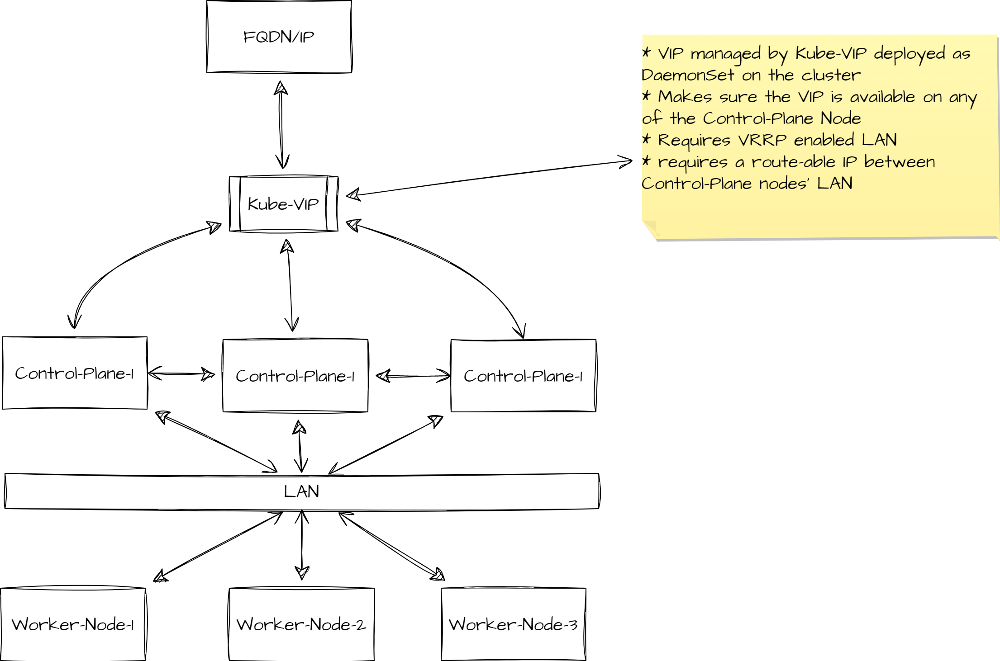

## RKE2 HA With VIP Load Balance Architecture



## Prepare
Source: https://docs.expertflow.com/cx/4.3/rke2-deployment-in-high-availability-with-kube-vip#id-(4.3)RKE2DeploymentinHighAvailabilityWithKube-VIP-OpenEBSforLocalStorage

### Install Sysbox Runtime

```bash
## https://github.com/nestybox/sysbox/blob/master/docs/user-guide/install-package.md#installing-sysbox

wget https://downloads.nestybox.com/sysbox/releases/v0.6.4/sysbox-ce_0.6.4-0.linux_amd64.deb
docker rm $(docker ps -a -q) -f
sudo apt-get install jq
sudo apt-get install ./sysbox-ce_0.6.4-0.linux_amd64.deb
```

### Start Docker Container Like VM

```bash
docker-compose up -d
docker ps -q | xargs -n 1 docker inspect --format '{{range .NetworkSettings.Networks}}{{.IPAddress}}{{end}} {{ .Name }}' | sed 's/ \// /'
#ssh user: admin(root)/admin
# 172.25.2.4 master-2
# 172.25.2.5 master-3
# 172.25.2.8 worker-3
# 172.25.2.6 worker-1
# 172.25.2.3 master-1
# 172.25.2.7 worker-2
```

### Add SSH Key And Change Machine Id
```
ssh-keygen
ssh-copy-id root@172.25.2.3
ssh-copy-id root@172.25.2.4
ssh-copy-id root@172.25.2.5
ssh-copy-id root@172.25.2.6
ssh-copy-id root@172.25.2.7
ssh-copy-id root@172.25.2.8 

ssh root@172.25.2.3 'echo $(uuidgen) > /etc/machine-id'
ssh root@172.25.2.4 'echo $(uuidgen) > /etc/machine-id'
ssh root@172.25.2.5 'echo $(uuidgen) > /etc/machine-id'
ssh root@172.25.2.6 'echo $(uuidgen) > /etc/machine-id'
ssh root@172.25.2.7 'echo $(uuidgen) > /etc/machine-id'
ssh root@172.25.2.8 'echo $(uuidgen) > /etc/machine-id'
```

## Step 1: Prepare First Control Plane (Master 1)

```
mkdir -p /etc/rancher/rke2/
mkdir -p  /var/lib/rancher/rke2/server/manifests/

cat<<EOF|tee /etc/rancher/rke2/config.yaml
tls-san:
  - 172.25.2.2
  - 172.25.2.3
  - 172.25.2.4
  - 172.25.2.5
write-kubeconfig-mode: "0600"
etcd-expose-metrics: true
cni:
  - canal

EOF

cat<<EOF| tee /var/lib/rancher/rke2/server/manifests/rke2-ingress-nginx-config.yaml
---
apiVersion: helm.cattle.io/v1
kind: HelmChartConfig
metadata:
  name: rke2-ingress-nginx
  namespace: kube-system
spec:
  valuesContent: |-
    controller:
      metrics:
        service:
          annotations:
            prometheus.io/scrape: "true"
            prometheus.io/port: "10254"
      config:
        use-forwarded-headers: "true"
      allowSnippetAnnotations: "true"
EOF

curl -sfL https://get.rke2.io | INSTALL_RKE2_TYPE=server sh -

systemctl start rke2-server

systemctl enable rke2-server

echo "export PATH=$PATH:/var/lib/rancher/rke2/bin" >> $HOME/.bashrc
echo "export KUBECONFIG=/etc/rancher/rke2/rke2.yaml"  >> $HOME/.bashrc 

cat /var/lib/rancher/rke2/server/node-token
#K10afc5ea685be81dd2350121951964b40dc71d873c8a6121d3733b79fa7bb15189::server:93aef2cd36bba68d113d436cc2f48b86

export VIP=172.25.2.2
export INTERFACE=eth0

curl https://kube-vip.io/manifests/rbac.yaml > /var/lib/rancher/rke2/server/manifests/kube-vip-rbac.yaml

/var/lib/rancher/rke2/bin/crictl -r "unix:///run/k3s/containerd/containerd.sock"  pull ghcr.io/kube-vip/kube-vip:latest

CONTAINERD_ADDRESS=/run/k3s/containerd/containerd.sock  ctr -n k8s.io run \
--rm \
--net-host \
ghcr.io/kube-vip/kube-vip:latest vip /kube-vip manifest daemonset --arp --interface $INTERFACE --address $VIP --controlplane  --leaderElection --taint --services --inCluster | tee /var/lib/rancher/rke2/server/manifests/kube-vip.yaml

kubectl rollout status daemonset   kube-vip-ds    -n kube-system   --timeout=650s

kubectl  get ds -n kube-system  kube-vip-ds

```

## Step 2: Remaining Control-Plane Nodes (Master 2, 3)

```
mkdir -p /etc/rancher/rke2/
mkdir -p  /var/lib/rancher/rke2/server/manifests/

cat<<EOF|tee /etc/rancher/rke2/config.yaml
server: https://172.25.2.2:9345
token: K10afc5ea685be81dd2350121951964b40dc71d873c8a6121d3733b79fa7bb15189::server:93aef2cd36bba68d113d436cc2f48b86
write-kubeconfig-mode: "0644" 
tls-san:
  - 172.25.2.2
  - 172.25.2.3
  - 172.25.2.4
  - 172.25.2.5
write-kubeconfig-mode: "0644"
etcd-expose-metrics: true
cni:
  - canal

EOF

cat<<EOF| tee /var/lib/rancher/rke2/server/manifests/rke2-ingress-nginx-config.yaml
---
apiVersion: helm.cattle.io/v1
kind: HelmChartConfig
metadata:
  name: rke2-ingress-nginx
  namespace: kube-system
spec:
  valuesContent: |-
    controller:
      metrics:
        service:
          annotations:
            prometheus.io/scrape: "true"
            prometheus.io/port: "10254"
      config:
        use-forwarded-headers: "true"
      allowSnippetAnnotations: "true"
EOF

curl -sfL https://get.rke2.io | INSTALL_RKE2_TYPE=server sh -
systemctl start rke2-server
systemctl enable rke2-server

echo "export PATH=$PATH:/var/lib/rancher/rke2/bin" >> $HOME/.bashrc
echo "export KUBECONFIG=/etc/rancher/rke2/rke2.yaml"  >> $HOME/.bashrc 
source ~/.bashrc

```

## Step 3: Deploy Worker Nodes (Worker 1, 2, 3)

```
mkdir -p /etc/rancher/rke2/

cat<<EOF|tee /etc/rancher/rke2/config.yaml
server: https://172.25.2.2:9345
token: K10afc5ea685be81dd2350121951964b40dc71d873c8a6121d3733b79fa7bb15189::server:93aef2cd36bba68d113d436cc2f48b86
write-kubeconfig-mode: \"0644\"

EOF

curl -sfL https://get.rke2.io | INSTALL_RKE2_TYPE=agent sh -
systemctl start rke2-agent.service
systemctl enable  rke2-agent.service
```
## Copy kubectl config
```
scp root@172.25.2.3:/etc/rancher/rke2/rke2.yaml .
sed -i -e 's/127.0.0.1/172.25.2.2/g' ./rke2.yaml
k get no --kubeconfig ./rke2.yaml
```

## Install local-path-storage
```
export KUBECONFIG=./rke2.yaml
kubectl apply -f https://raw.githubusercontent.com/rancher/local-path-provisioner/v0.0.26/deploy/local-path-storage.yaml
kubectl patch storageclass local-path -p '{"metadata": {"annotations":{"storageclass.kubernetes.io/is-default-class":"true"}}}'
```

## TEST

```
helm upgrade --install minio -n minio -f ../../charts/minio/minio-values.yaml ../../charts/minio --create-namespace --debug

# add new row to /etc/hosts 
# 172.25.2.3  minio.lakehouse.local
# go to http://minio.lakehouse.local
```